# 🎬 NitroCine - Movie Ticket Booking System

<div align="center">


**A complete MERN Stack application for booking movie tickets online with real-time seat locking and secure payments.**

[](https://nitrocine.vercel.app/)

</div>

---

## ✨ Key Features

### For Users 👤

- **Secure Authentication:** Easy login and registration using Clerk.
- **Discover Movies:** Browse featured, trending, and upcoming movies.
- **Watch Trailers:** Integrated video player to watch movie trailers directly.
- **Interactive Seat Selection:** Pick your favorite seats with a real-time availability map.
- **Concurrency Safe:** The system locks your seat while you pay so no one else can take it.
- **Secure Checkout:** Process payments safely using Stripe.
- **User Dashboard:** Track your booking history and favorite movies easily.

### For Admins 🛡️

- **Analytics Dashboard:** View total revenue, ticket sales, and user growth charts.
- **Showtime Management:** Create, update, and schedule new movie shows.
- **Booking Overview:** Monitor and manage all customer tickets in one place.

---

## 📸 Application Screenshots

### 🎭 User Interface

### 🎭 Client Interface

| **Home Page** | **Now Showing** |
|:---:|:---:|
| 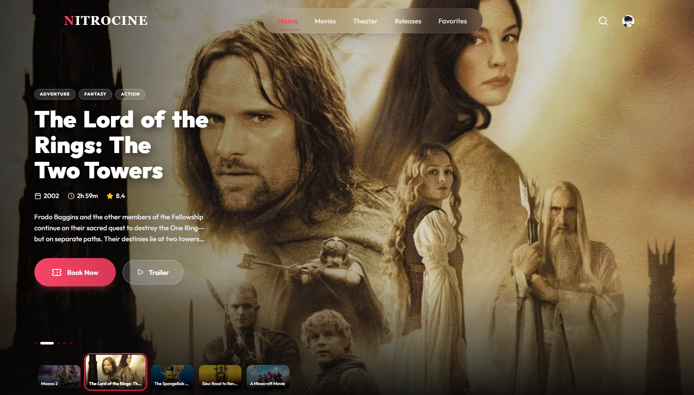 | 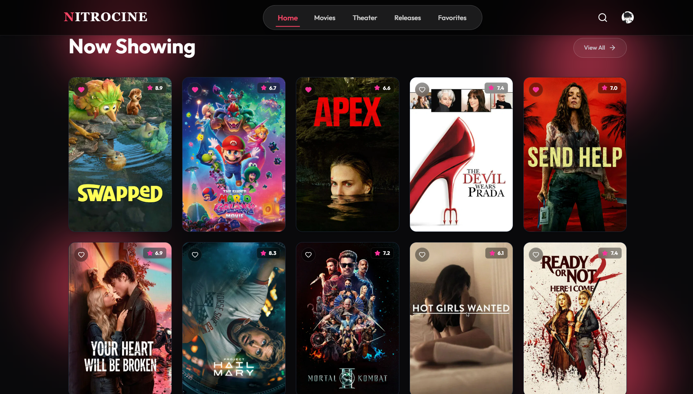 |
| *Hero banner with auto-sliding movies.* | *Grid of popular movies ready to book.* |

| **Trailer Player** | **Upcoming Releases** |
|:---:|:---:|
| 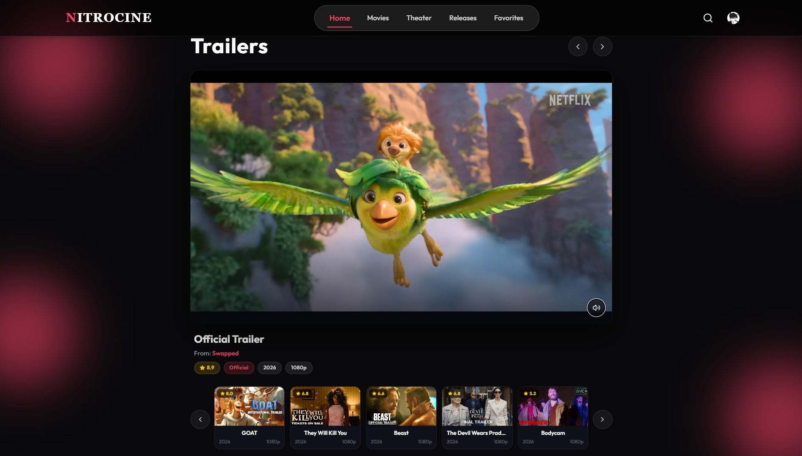 | 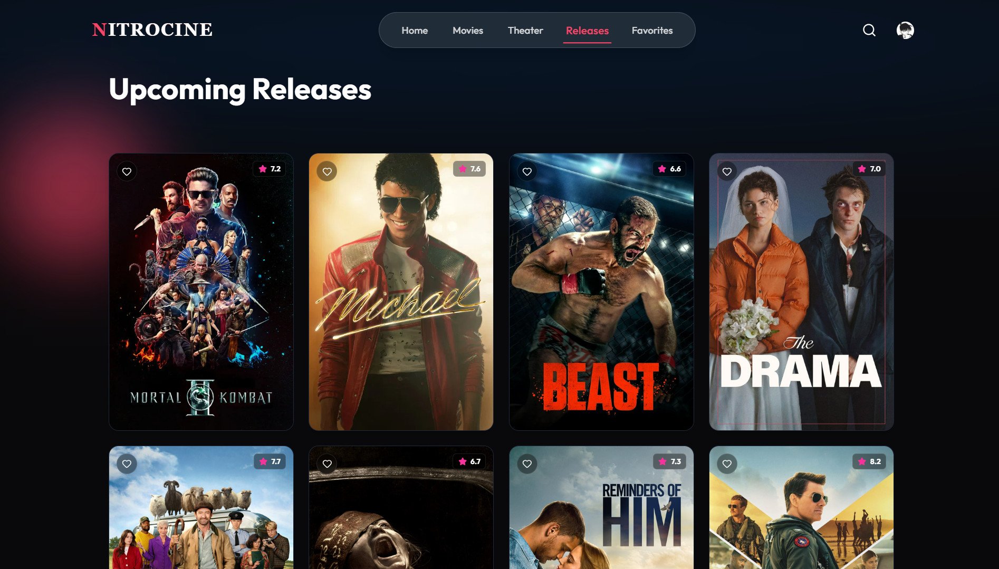 |
| *Watch trailers with mute & pause controls.* | *Browse movies coming soon to theaters.* |

| **Search Bar** | **Search Results** |
|:---:|:---:|
| 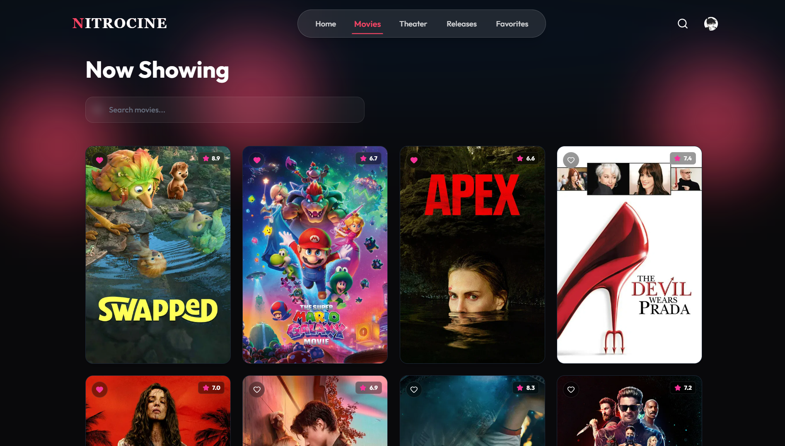 | 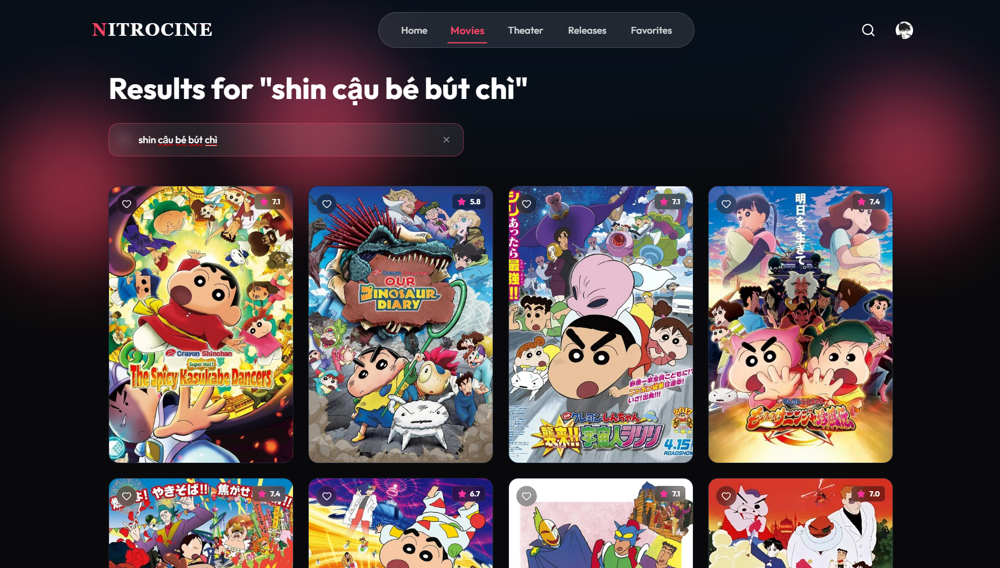 |
| *Live search powered by TMDB API.* | *Results filtered as you type (debounced).* |

| **Favorites** | **Movie Details** |
|:---:|:---:|
| 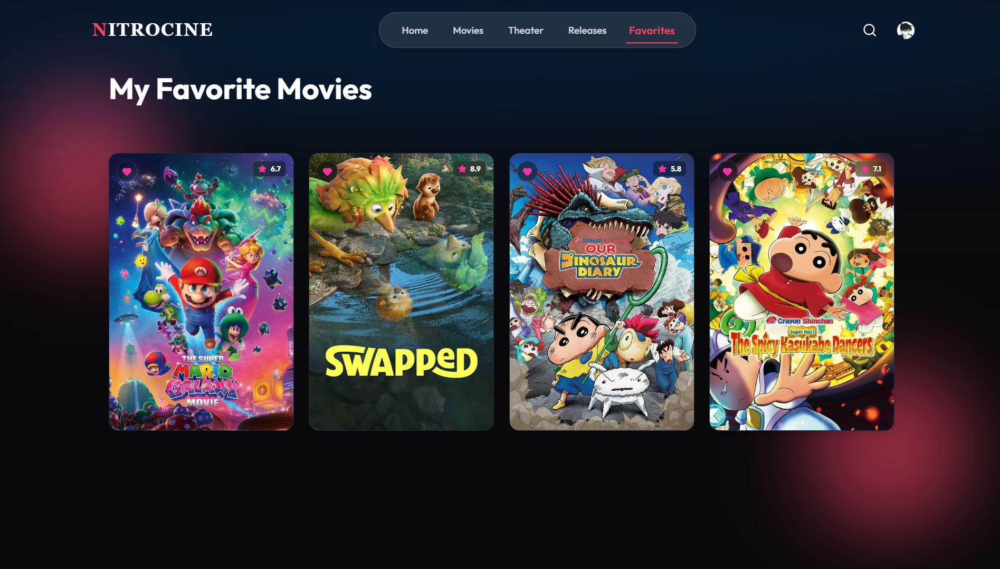 | 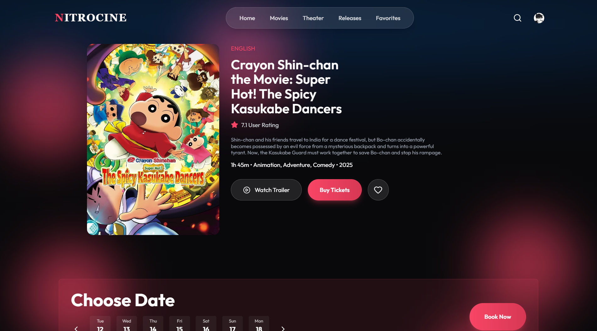 |
| *Movies you saved to your watchlist.* | *Rating, runtime, genres and showtimes.* |

| **Seat Selection** | **My Bookings** |
|:---:|:---:|
| 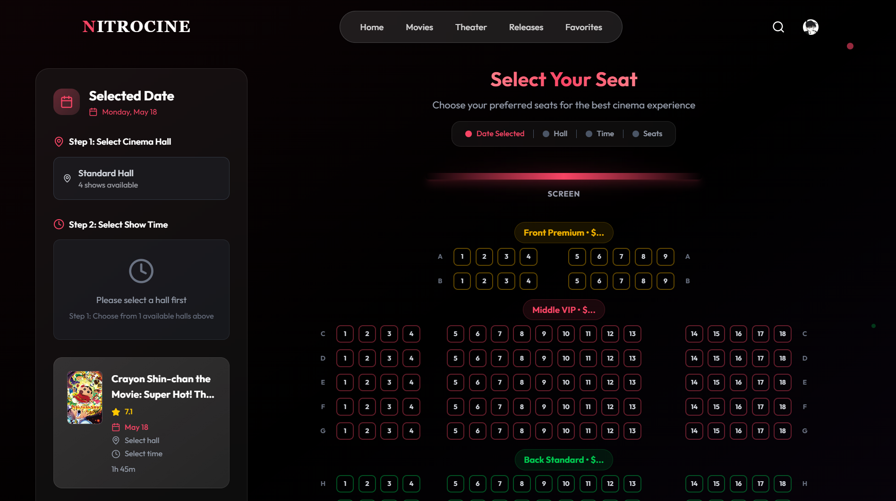 | 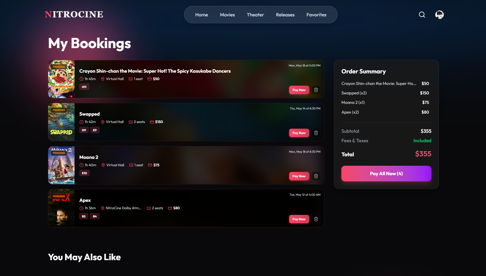 |
| *Interactive seat map with live updates.* | *View tickets and pay with Stripe.* |

| **Account Settings** |
|:---:|
| 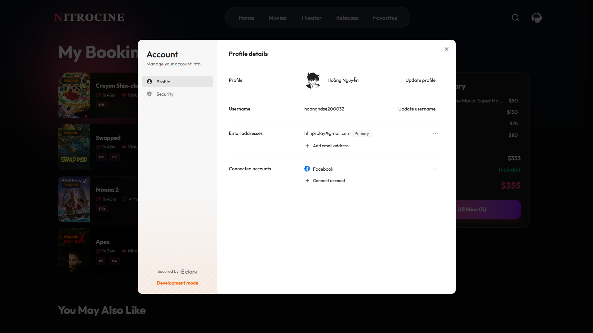 |
| *Manage your profile via Clerk.* |

---

### 🛠️ Admin Control Panel

| **Dashboard** | **Add New Showtime** |
|:---:|:---:|
| 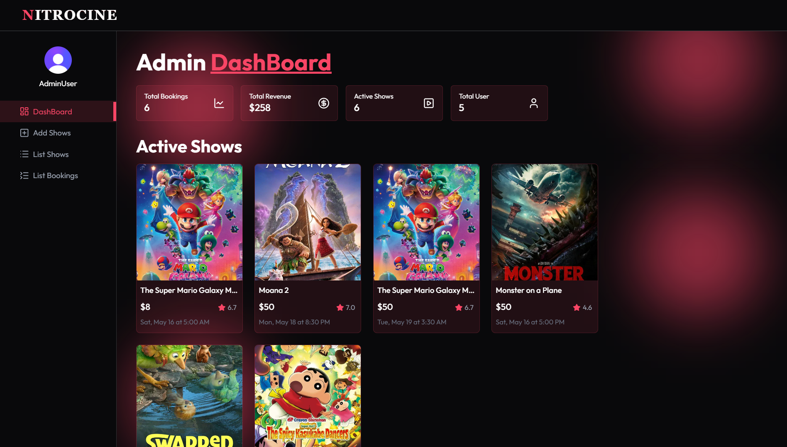 | 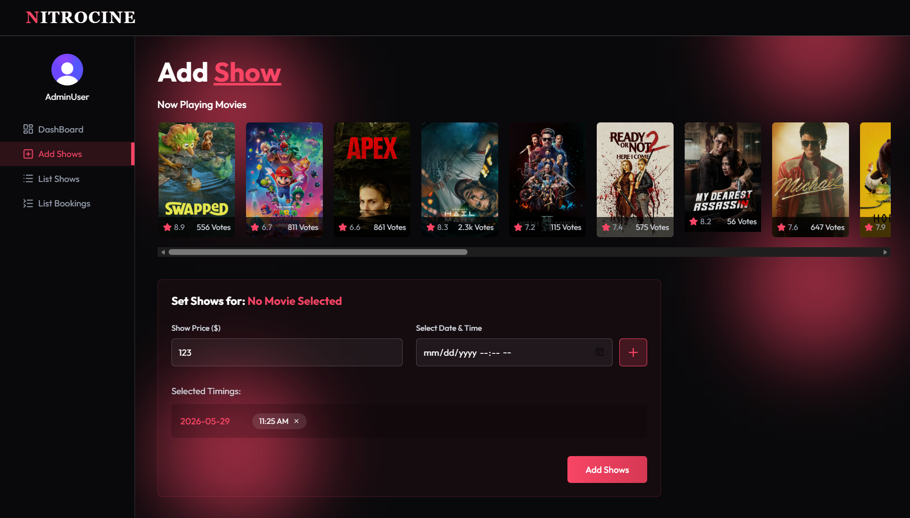 |
| Total revenue, bookings, active shows overview. | Pick a movie and schedule screening times. |

| **Manage Shows** |
|:---:|
| 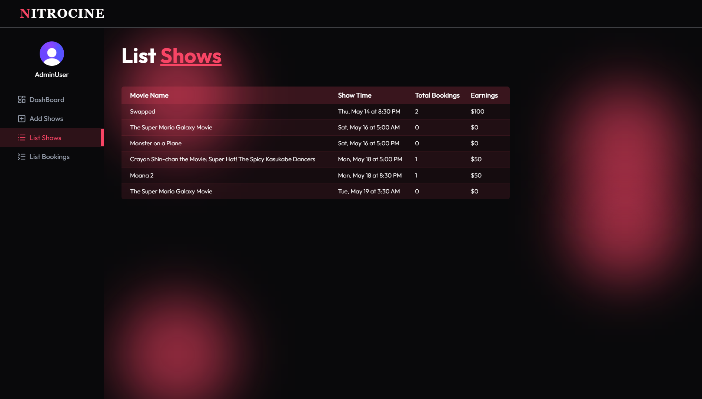 |
| View all upcoming shows with ticket counts and earnings. |

---

## ⚙️ How It Works (Request Flow)

When a user books a ticket, the system follows this simple and secure flow to make sure seats are booked correctly without errors:

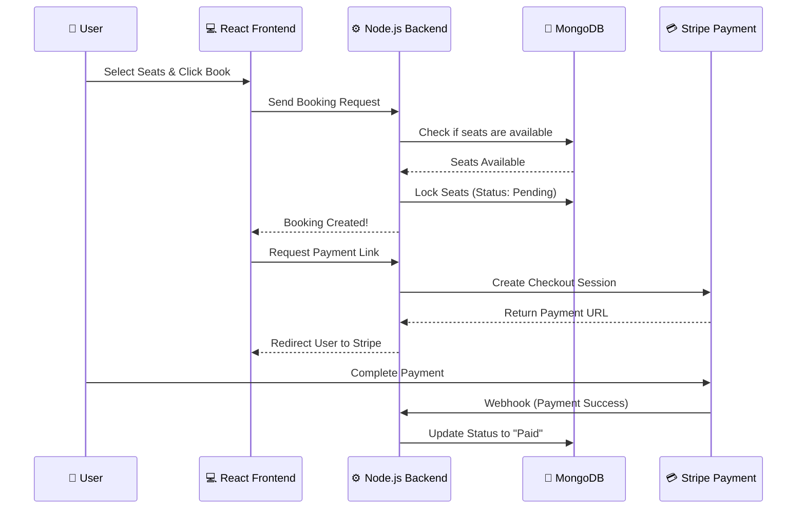

---

## 📂 Project Structure

```
cinema-booking/
├── client/                     # Frontend built with React & Vite
│   ├── src/components/         # Reusable UI parts (Navbar, Cards, Loading)
│   ├── src/pages/              # Main pages (Home, SeatLayout, Admin Dashboard)
│   ├── src/context/            # App state and Authentication logic
│   └── src/lib/                # Helpful tools for formatting time and dates
├── server/                     # Backend built with Node.js & Express
│   ├── controllers/            # Logic for Booking, Shows, and Payments
│   ├── models/                 # Database schemas (User, Show, Booking, Movie)
│   ├── inngest/                # Background tasks (e.g., handling timeouts)
│   ├── routes/                 # API endpoint connections
│   └── server.js               # Main entry point for the backend
├── deploy/aws/                 # Scripts to deploy the project to AWS
└── docker-compose.yml          # Docker config to run the app easily
```

---

## 📡 Main API Endpoints

### Booking & Payments

| Method | Endpoint | Description |
|--------|----------|-------------|
| `POST` | `/api/booking/create` | Locks the selected seats and creates a pending ticket. |
| `POST` | `/api/booking/pay-now` | Generates a secure Stripe checkout link. |
| `GET`  | `/api/booking/my-bookings` | Gets the ticket history for the logged-in user. |
| `POST` | `/api/stripe/webhook` | Listens to Stripe to know when a user has paid. |

### Shows & Admin

| Method | Endpoint | Description |
|--------|----------|-------------|
| `GET`  | `/api/show` | Gets the list of available movie showtimes. |
| `POST` | `/api/admin/dashboard` | Gets data for the admin revenue charts. |
| `POST` | `/api/admin/movies` | Adds new movies to the database. |

---

## 🛠️ Technology Stack

| Layer | Technologies |
|-------|-------------|
| **Frontend** | React 19, Vite, Tailwind CSS, Axios |
| **Backend** | Node.js, Express.js |
| **Database** | MongoDB Atlas, Mongoose |
| **Authentication** | Clerk |
| **Payment Gateway** | Stripe |
| **Background Jobs** | Inngest |
| **Cloud & DevOps** | AWS, Docker |

---

## 🚀 How to Run Locally

### 1. Clone the repository

```bash
git clone https://github.com/hoangduc1003/cinema-booking.git
cd cinema-booking
```

### 2. Setup the Backend

Open a terminal and go to the server folder:

```bash
cd server
npm install
```

Create a `.env` file in the `server` folder and add your secret keys:

```env
PORT=3000
MONGODB_URI=your_mongodb_connection_string
CLERK_SECRET_KEY=your_clerk_secret_key
STRIPE_SECRET_KEY=your_stripe_secret_key
STRIPE_WEBHOOK_SECRET=your_stripe_webhook_secret
```

Start the backend server:

```bash
npm run server
```

### 3. Setup the Frontend

Open a new terminal and go to the client folder:

```bash
cd client
npm install
```

Create a `.env.local` file in the `client` folder:

```env
VITE_CLERK_PUBLISHABLE_KEY=your_clerk_publishable_key
VITE_API_URL=http://localhost:3000/api
```

Start the frontend app:

```bash
npm run dev
```

---

## 👨‍💻 Author

**Nguyễn Đức Hoàng**

- GitHub: [@hoangduc1003](https://github.com/hoangduc1003)
- Focus: Backend Development & High-Performance Computing

If you found this project helpful, please give it a ⭐!