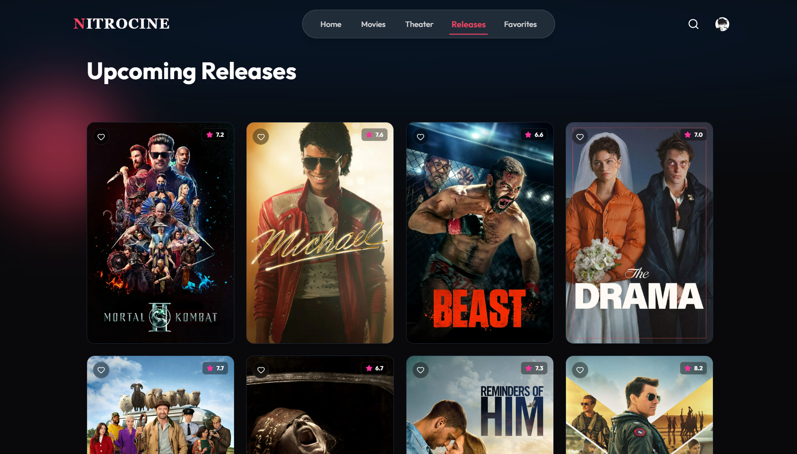
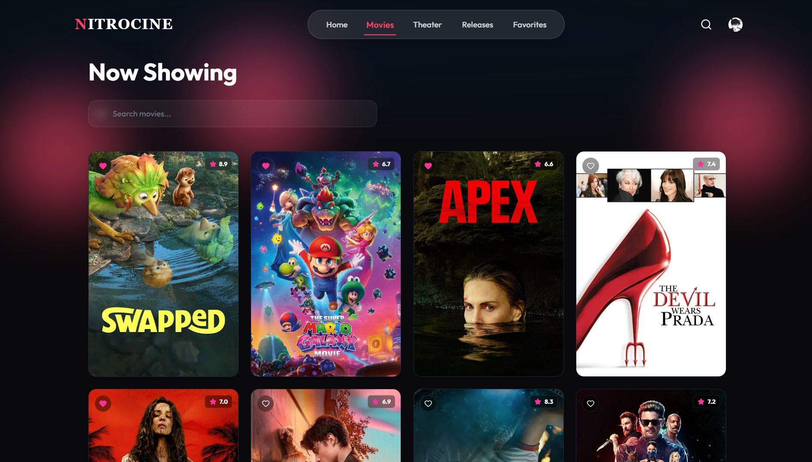
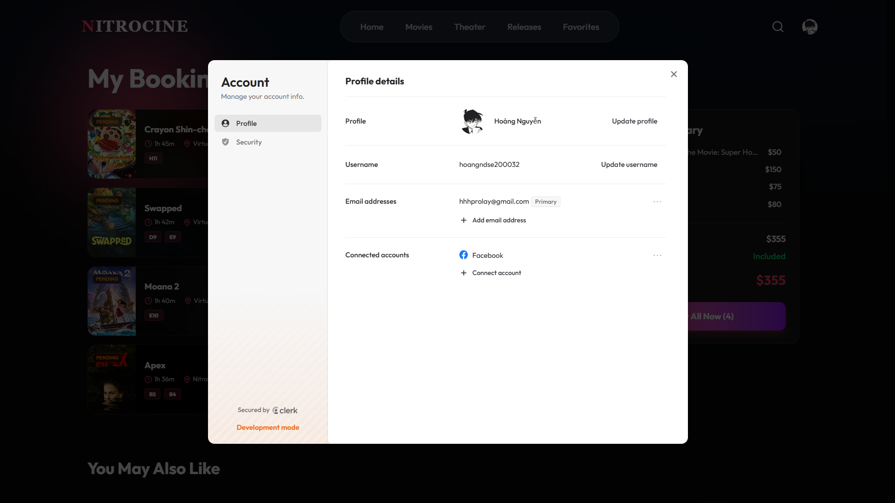
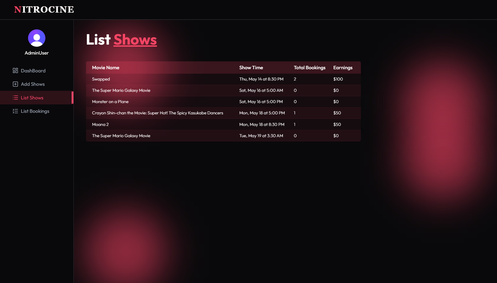
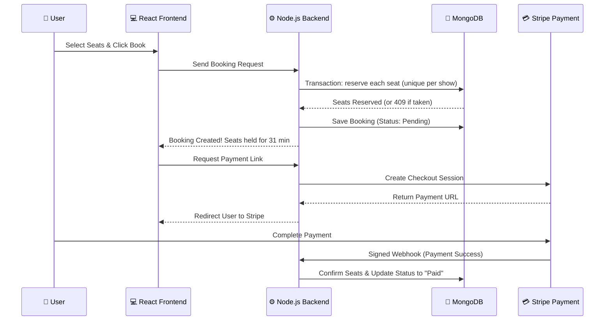

# 🎬 NitroCine - Movie Ticket Booking System

<div align="center">


**A complete MERN Stack application for booking movie tickets online with real-time seat locking and secure payments.**

[](https://nitrocine.vercel.app/)

</div>

---

## ✨ Key Features

### For Users 👤

- **Secure Authentication:** Easy login and registration using Clerk.
- **Discover Movies:** A home banner that changes daily (two hot new releases and three classics), Now Showing, search, and upcoming releases.
- **Watch Trailers:** Play trailers from the home page or from a preview on each movie page.
- **Showtimes:** Pick a date from the next seven days, with three showtimes a day.
- **Interactive Seat Selection:** Pick your favorite seats with a real-time availability map.
- **Concurrency Safe:** Your seats are held while you pay, and the database guarantees a seat can never be sold twice.
- **Secure Checkout:** Process payments safely using Stripe.
- **User Dashboard:** Track your booking history and favorite movies easily.

### For Admins 🛡️

- **Analytics Dashboard:** View total revenue, bookings, and active shows.
- **Showtime Management:** Add shows for a movie and sync showtimes on demand.
- **Booking Overview:** Monitor all customer bookings in one place.
- **Hero Settings:** Let the home banner rotate daily, or pick five movies by hand.

---

## 📸 Application Screenshots

### 🎭 User Interface

| **Home Page** | **Now Showing** |
|:---:|:---:|
|  |  |
| *Hero banner with auto-sliding movies.* | *Grid of popular movies ready to book.* |

| **Trailer Player** | **Upcoming Releases** |
|:---:|:---:|
|  |  |
| *Watch trailers with mute & pause controls.* | *Browse movies coming soon to theaters.* |

| **Search Bar** | **Search Results** |
|:---:|:---:|
|  |  |
| *Live search powered by TMDB API.* | *Results filtered as you type (debounced).* |

| **Favorites** | **Movie Details** |
|:---:|:---:|
|  |  |
| *Movies you saved to your watchlist.* | *Rating, runtime, genres and showtimes.* |

| **Seat Selection** | **My Bookings** |
|:---:|:---:|
|  |  |
| *Interactive seat map with live updates.* | *View tickets and pay with Stripe.* |

| **Account Settings** |
|:---:|
|  |
| *Manage your profile via Clerk.* |

---

### 🛠️ Admin Control Panel

| **Dashboard** | **Add New Showtime** |
|:---:|:---:|
|  |  |
| Total revenue, bookings, active shows overview. | Pick a movie and schedule screening times. |

| **Manage Shows** |
|:---:|
|  |
| View all upcoming shows with ticket counts and earnings. |

---

## ⚙️ How It Works (Request Flow)

When a user books a ticket, the system follows this simple and secure flow to make sure seats are booked correctly without errors:


```mermaid
sequenceDiagram
    participant User as 👤 User
    participant Frontend as 💻 React Frontend
    participant Backend as ⚙️ Node.js Backend
    participant DB as 🍃 MongoDB
    participant Stripe as 💳 Stripe Payment

    User->>Frontend: Select Seats & Click Book
    Frontend->>Backend: Send Booking Request
    Backend->>DB: Transaction: reserve each seat (unique per show)
    DB-->>Backend: Seats Reserved (or 409 if taken)
    Backend->>DB: Save Booking (Status: Pending)
    Backend-->>Frontend: Booking Created! Seats held for 31 min
    Frontend->>Backend: Request Payment Link
    Backend->>Stripe: Create Checkout Session
    Stripe-->>Backend: Return Payment URL
    Backend-->>Frontend: Redirect User to Stripe
    User->>Stripe: Complete Payment
    Stripe->>Backend: Signed Webhook (Payment Success)
    Backend->>DB: Confirm Seats & Update Status to "Paid"
```

---

## 📂 Project Structure

```
Cinema-booking/
├── client/                     # Frontend built with React & Vite
│   ├── src/components/         # Reusable UI parts (Navbar, Cards, Loading)
│   ├── src/pages/              # Main pages (Home, SeatLayout, Admin Dashboard)
│   ├── src/context/            # App state and Authentication logic
│   ├── src/lib/                # API client and formatting helpers
│   ├── tests/                  # Unit tests
│   └── e2e/                    # Playwright end-to-end tests
├── server/                     # Backend built with Node.js & Express
│   ├── controllers/            # Logic for Booking, Shows, and Payments
│   ├── models/                 # Database schemas (User, Show, Booking, Movie)
│   ├── inngest/                # Background jobs (daily showtime sync, catalog refresh)
│   ├── routes/                 # API endpoint connections
│   ├── middleware/             # Auth, CORS, error handling
│   ├── services/               # Booking, showtimes, Hero, Redis cache and locks
│   ├── scripts/                # Seed, sync and load-test scripts
│   ├── tests/                  # Unit and opt-in integration tests
│   └── api/index.js            # Main entry point for the backend
├── docs/                       # Booking, payment and deployment notes
├── images/                     # README screenshots
└── .github/workflows/          # CI: lint, test and build on every push
```

---

## 📡 Main API Endpoints

### Booking & Payments

| Method | Endpoint | Description |
|--------|----------|-------------|
| `POST` | `/api/booking/create` | Locks the selected seats and creates a pending ticket. |
| `POST` | `/api/booking/pay-now` | Generates a secure Stripe checkout link. |
| `GET`  | `/api/booking/my-bookings` | Gets the ticket history for the logged-in user. |
| `DELETE` | `/api/booking/:id` | Cancels an unpaid booking and releases its seats. |
| `POST` | `/api/webhooks/stripe` | Idempotently processes verified Stripe events. |

### Shows & Admin

| Method | Endpoint | Description |
|--------|----------|-------------|
| `GET`  | `/api/show/hero` | Gets today's five home banner movies. |
| `GET`  | `/api/show/all` | Gets the movies that have bookable shows. |
| `GET`  | `/api/show/:movieId` | Gets movie details and seven days of showtimes. |
| `GET`  | `/api/show/cinemas` | Gets the cached cinema/hall list. |
| `GET`  | `/api/health` | Liveness check (`/api/health/ready` also checks MongoDB and Redis). |
| `GET`  | `/api/admin/dashboard` | Gets data for the admin revenue charts. |
| `POST` | `/api/show/add` | Adds shows for a movie (admin only). |
| `POST` | `/api/show/sync-now-playing` | Regenerates showtimes for featured movies (admin only). |

---

## 🛠️ Technology Stack

| Layer | Technologies |
|-------|-------------|
| **Frontend** | React 19, Vite, Tailwind CSS, Axios |
| **Backend** | Node.js, Express.js |
| **Database** | MongoDB Atlas, Mongoose |
| **Cache & Coordination** | Redis cache, seat holds, locks, idempotency |
| **Authentication** | Clerk |
| **Payment Gateway** | Stripe |
| **Background Jobs** | Inngest |
| **Movie Data** | TMDB API (called from the backend only) |
| **Cloud & DevOps** | Vercel, GitHub Actions CI |

---

## 🚀 How to Run Locally

### 1. Clone the repository

Booking correctness is enforced by MongoDB transactions plus the unique
`SeatReservation(show, seat)` index. Redis accelerates reads and coordinates
seat holds, but it is not the only double-booking guard. See
[`docs/redis-booking.md`](./docs/redis-booking.md) for keys, TTLs, invalidation,
index rollout, health behavior, and concurrency testing.
See [`docs/payment-booking-debug.md`](./docs/payment-booking-debug.md) for Stripe
configuration, pending-hold recovery, safe logs, and pay-now/pay-all retries.
See [`docs/production-deployment.md`](./docs/production-deployment.md) for
environment variables, the showtime sync, and release/rollback steps.

```bash
git clone https://github.com/HoangDuc1003/Cinema-booking.git
cd Cinema-booking
```

### 2. Setup the Backend

Open a terminal and go to the server folder:

```bash
cd server
npm install
```

Copy `server/.env.example` to `.env`, then add real values only to this ignored
local file:

```bash
cp .env.example .env
```

```env
PORT=3000
MONGODB_URI=your_mongodb_connection_string
REDIS_URL=your_redis_connection_url
REDIS_KEY_PREFIX=nitrocine
CLIENT_URL=http://localhost:5173
CLERK_PUBLISHABLE_KEY=your_clerk_publishable_key
CLERK_SECRET_KEY=your_clerk_secret_key
TMDB_API_KEY=your_tmdb_read_access_token
STRIPE_SECRET_KEY=your_stripe_secret_key
STRIPE_WEBHOOK_SECRET=your_stripe_webhook_secret
```

Start the backend server:

```bash
npm run server
```

Run server checks with `npm run lint` and `npm test`. MongoDB must be Atlas/a replica set for
transactions. Redis is optional locally. The full variable list is in `server/.env.example`.
Never commit a real Redis URL or provider secret.

### 3. Setup the Frontend

Open a new terminal and go to the client folder:

```bash
cd client
npm install
```

Copy `client/.env.example` to `.env.local`. `VITE_*` values are public browser
configuration and must not contain server secrets.

```env
VITE_CLERK_PUBLISHABLE_KEY=your_clerk_publishable_key
VITE_BASE_URL=http://localhost:3000
# TMDB requests are proxied through the backend; no browser TMDB key is needed.
```

Start the frontend app:

```bash
npm run dev
```

---

## 👨‍💻 Author

**Nguyễn Đức Hoàng**

- GitHub: [@HoangDuc1003](https://github.com/HoangDuc1003)
- Focus: Backend Development & High-Performance Computing

If you found this project helpful, please give it a ⭐!
