# NitroCine

[](https://github.com/HoangDuc1003/Cinema-booking/actions/workflows/ci.yml)


A full-stack cinema booking web app. Browse what is showing, watch trailers, pick seats on a live seat map and pay with Stripe. Two people can never buy the same seat.

**Live demo:** [nitrocine.vercel.app](https://nitrocine.vercel.app/)

When running with Stripe test keys, pay with card `4242 4242 4242 4242`, any future date and any CVC.

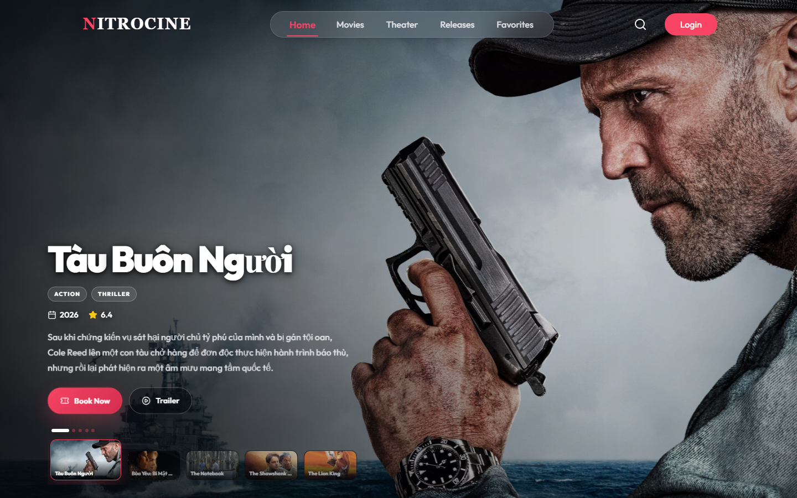

## Contents

- [Features](#features)
- [Tech stack](#tech-stack)
- [Architecture](#architecture)
- [How booking stays correct](#how-booking-stays-correct)
- [Getting started](#getting-started)
- [Scripts](#scripts)
- [Testing](#testing)
- [API overview](#api-overview)
- [Project structure](#project-structure)
- [Deployment](#deployment)
- [Known limitations](#known-limitations)
- [Author](#author)

## Features

**For moviegoers**

- Sign up and sign in with Clerk, then create viewer profiles.
- A home Hero of five posters that changes every day: two of the newest, most popular releases, then three classics.
- A Now Showing list of current Vietnamese releases, fetched from TMDB.
- Search, upcoming releases, a theater page and a favorites list.
- Trailers: a trailer rail on the home page, plus a trailer preview dialog on each movie page.
- Showtimes for the next seven days, then a seat map with three seat classes and live availability.
- Stripe Checkout payment. Seats are held while you pay and released if you cancel or the hold expires.
- A My Bookings page that shows ticket history and can resume payment for pending bookings.
- A separate mobile layout.

**For admins**

- A dashboard with revenue, bookings and active shows.
- Add shows and list all shows and bookings.
- Hero settings: automatic daily rotation, or five hand-picked movies.
- Catalog refresh and showtime sync on demand.

## Tech stack

| Layer | Technology |
|---|---|
| Frontend | React 19, Vite, Tailwind CSS 4, React Router, Axios |
| Backend | Node.js 20+, Express 5 |
| Database | MongoDB Atlas with Mongoose (transactions need a replica set) |
| Cache and coordination | Redis: read cache, seat holds, distributed locks, webhook idempotency |
| Auth | Clerk |
| Payments | Stripe Checkout and webhooks |
| Background jobs | Inngest (cron and event-driven functions) |
| Movie data | TMDB API, always called from the backend |
| Testing | `node:test` unit tests, Playwright end-to-end tests |
| CI/CD | GitHub Actions for lint, test and build; Vercel for hosting |

## Architecture

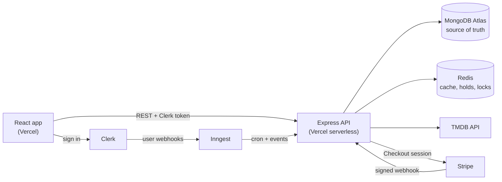
```mermaid
flowchart LR
    Browser["React app<br/>(Vercel)"] -->|REST + Clerk token| API["Express API<br/>(Vercel serverless)"]
    Browser -->|sign in| Clerk
    API --> MongoDB[("MongoDB Atlas<br/>source of truth")]
    API --> Redis[("Redis<br/>cache, holds, locks")]
    API --> TMDB["TMDB API"]
    API -->|Checkout session| Stripe
    Stripe -->|signed webhook| API
    Inngest -->|cron + events| API
    Clerk -->|user webhooks| Inngest
```

- **MongoDB is the source of truth.** If Redis is down, pages load more slowly but booking stays correct.
- **The TMDB key never reaches the browser.** The client calls the backend, which calls TMDB and caches the result.
- **Inngest runs the scheduled work:**
  - a daily showtime sync at 00:05 Vietnam time,
  - a weekly catalog refresh,
  - catalog slot rotation at 08:00 and 20:00,
  - syncing Clerk users into MongoDB.

### Showtimes

TMDB provides movie data, not real cinema schedules, so NitroCine generates **mock showtimes**. Only the movies the home page features get them: the five Hero posters and the ten Now Showing movies.

- Each featured movie gets three start times a day for seven days. The times fall between 09:00 and 23:00 and never overlap.
- The times are seeded by movie and date, so running the sync again reuses the same shows instead of adding duplicates.
- A featured movie whose schedule is incomplete is filled in the moment someone opens it, so a fresh deploy never shows an empty date picker.
- The daily sync closes unbooked shows for movies that are no longer featured.

Details are in [docs/production-deployment.md](./docs/production-deployment.md).

## How booking stays correct

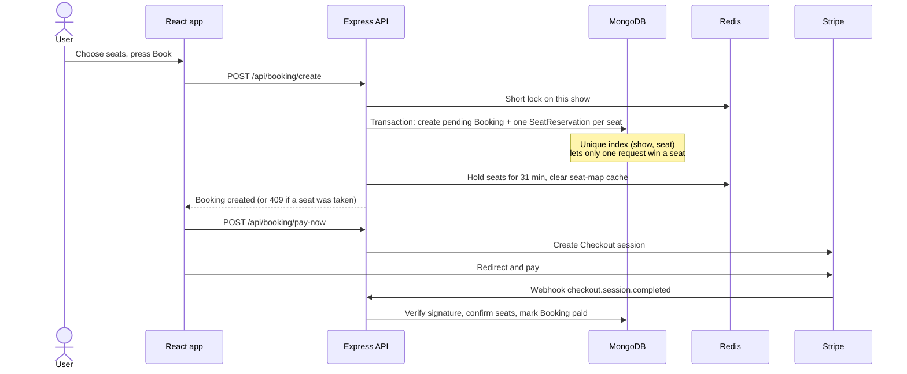
```mermaid
sequenceDiagram
    actor User
    participant Client as React app
    participant API as Express API
    participant DB as MongoDB
    participant Redis
    participant Stripe

    User->>Client: Choose seats, press Book
    Client->>API: POST /api/booking/create
    API->>Redis: Short lock on this show
    API->>DB: Transaction: create pending Booking + one SeatReservation per seat
    Note over DB: Unique index (show, seat)<br/>lets only one request win a seat
    API->>Redis: Hold seats for 31 min, clear seat-map cache
    API-->>Client: Booking created (or 409 if a seat was taken)
    Client->>API: POST /api/booking/pay-now
    API->>Stripe: Create Checkout session
    Client->>Stripe: Redirect and pay
    Stripe->>API: Webhook checkout.session.completed
    API->>DB: Verify signature, confirm seats, mark Booking paid
```

- **The database index is the real guard.** A unique index on `SeatReservation(show, seat)` means a seat can be reserved only once, however many requests arrive together. The losing request gets HTTP 409.
- **Redis only reduces contention.** Its lock and hold cut down on collisions and speed up the seat map, but correctness does not depend on them.
- **The server recalculates the price** from the show price and seat class, and it caps a booking at eight seats.
- **Webhooks are verified and idempotent.** Stripe events are checked against their signature, and a repeated event is ignored.

The full design is in [docs/redis-booking.md](./docs/redis-booking.md), and payment recovery is in [docs/payment-booking-debug.md](./docs/payment-booking-debug.md).

## Getting started

### Prerequisites

- Node.js 20 or newer
- A MongoDB Atlas cluster (the free tier works; transactions need a replica set)
- Free accounts on [Clerk](https://clerk.com), [TMDB](https://www.themoviedb.org/settings/api) and [Stripe](https://dashboard.stripe.com/test/apikeys)
- Optional: Redis (for example Upstash) and the [Stripe CLI](https://docs.stripe.com/stripe-cli) for local webhooks

### 1. Clone

```bash
git clone https://github.com/HoangDuc1003/Cinema-booking.git
cd Cinema-booking
```

### 2. Backend

```bash
cd server
npm install
cp .env.example .env
npm run dev
```

Fill in the **Required** section of `server/.env`: `MONGODB_URI`, the Clerk keys, `TMDB_API_KEY`, and the Stripe keys. Every other variable has a default and is documented in [`server/.env.example`](./server/.env.example).

The API runs at `http://localhost:3000`. To check it is up, open `http://localhost:3000/api/health`.

### 3. Frontend

In a second terminal:

```bash
cd client
npm install
cp .env.example .env.local
npm run dev
```

Set `VITE_CLERK_PUBLISHABLE_KEY` in `client/.env.local`, then open `http://localhost:5173`.

### 4. Stripe webhooks (optional, needed to complete a payment locally)

```bash
stripe listen --forward-to localhost:3000/api/webhooks/stripe
```

Copy the `whsec_...` secret the command prints into `STRIPE_WEBHOOK_SECRET`, then restart the backend.

### 5. Admin access

Admin pages are under `/admin`. To give an account access, open that user in the Clerk dashboard and set its **private metadata** to:

```json
{ "role": "admin" }
```

## Scripts

| Where | Command | What it does |
|---|---|---|
| `server` | `npm run dev` | Start the API with auto-reload (nodemon) |
| `server` | `npm start` | Start the API |
| `server` | `npm run lint` | ESLint |
| `server` | `npm test` | Unit tests |
| `server` | `npm run sync:now-playing` | Regenerate mock showtimes for the featured movies |
| `server` | `npm run seed:catalog` | Build the weekly 150-movie catalog from TMDB |
| `server` | `npm run test:concurrency` | Fire parallel bookings at one seat on a test deployment |
| `client` | `npm run dev` | Start the Vite dev server |
| `client` | `npm run build` | Production build |
| `client` | `npm run lint` | ESLint |
| `client` | `npm test` | Unit tests |
| `client` | `npm run test:e2e` | Playwright end-to-end tests |

## Testing

```bash
cd server && npm test
cd client && npm test
```

- **Unit tests** use in-memory fakes, so they need no database, Redis or API keys. GitHub Actions runs them, together with lint and the client build, on every push and pull request.
- **Integration tests** run real MongoDB transactions and are skipped by default. To run them, point `TEST_MONGODB_URI` at a disposable replica set and set `ALLOW_INTEGRATION_TESTS=true`. Never point them at a real database.
- **Concurrency check.** `npm run test:concurrency` sends many bookings for the same seat and expects exactly one to succeed. It writes real data, so it asks for explicit confirmation; see [docs/redis-booking.md](./docs/redis-booking.md).

## API overview

All routes are under `/api`. Routes marked 🔒 need a signed-in user, and 🛡️ need an admin.

| Method | Route | Description |
|---|---|---|
| GET | `/show/hero` | Today's five Hero movies |
| GET | `/show/tmdb/home-now-showing` | Now Showing list |
| GET | `/show/tmdb/movie/:movieId` | Movie details |
| GET | `/show/:movieId` | Movie plus seven days of showtimes |
| POST | `/show/tmdb/trailers` | Trailers for up to ten movies |
| GET | `/show/tmdb/search?query=` | Movie search |
| GET | `/booking/seat/:showId` | Seats already taken for a show |
| POST | `/booking/create` 🔒 | Hold seats and create a pending booking |
| POST | `/booking/pay-now` 🔒 | Stripe Checkout link for one booking |
| GET | `/booking/my-bookings` 🔒 | The user's bookings |
| DELETE | `/booking/:id` 🔒 | Cancel an unpaid booking and release its seats |
| POST | `/webhooks/stripe` | Stripe events (signature verified) |
| GET | `/admin/dashboard` 🛡️ | Revenue and booking statistics |
| POST | `/show/add` 🛡️ | Add shows for a movie |
| POST | `/show/sync-now-playing` 🛡️ | Run the showtime sync now |
| PUT | `/admin/hero` 🛡️ | Switch the Hero between auto and manual |
| GET | `/health` | Liveness check (`/health/ready` also checks dependencies) |

Every response is JSON with a `success` flag, and failures carry a `message`. Unknown routes return a JSON 404, and unexpected server errors return a generic 500 with a `requestId` you can match against the server logs.

## Project structure

```text
.
├── .github/workflows/ci.yml   Lint, test and build on every push
├── client/                    React + Vite frontend
│   ├── api/                   Vercel function that proxies Clerk in production
│   ├── e2e/                   Playwright tests
│   ├── tests/                 Unit tests
│   └── src/
│       ├── components/        UI parts (hero/, mobile/, trailer, seat map…)
│       ├── context/           App, home-data and profile state
│       ├── lib/ services/     API client, TMDB helpers, caching
│       └── pages/             Routes, including admin/
├── server/                    Express API
│   ├── api/index.js           App entry point (also the Vercel function)
│   ├── configs/               MongoDB, Redis and runtime config
│   ├── controllers/           Request handlers
│   ├── inngest/               Scheduled and event-driven jobs
│   ├── middleware/            Auth, CORS, request ID, error handling
│   ├── models/                Mongoose schemas
│   ├── routes/                Route definitions
│   ├── scripts/               Seed, sync, migration and load-test scripts
│   ├── services/              Business logic: booking, showtimes, Hero, cache, locks
│   └── tests/                 Unit and opt-in integration tests
├── docs/                      Operations notes (booking, payments, deployment)
└── images/                    README screenshots
```

## Deployment

The frontend and backend are two Vercel projects deployed from this repository:

- The **`client`** project is a static Vite build.
- The **`server`** project runs `api/index.js` as a serverless function.

Set the environment variables from both `.env.example` files in each project's settings. Point the Stripe webhook at `https://<server-domain>/api/webhooks/stripe`, and register the Inngest app at `https://<server-domain>/api/inngest`.

The release checklist and rollback steps are in [docs/production-deployment.md](./docs/production-deployment.md).

## Screenshots

| Now Showing | Movie details and showtimes |
|:---:|:---:|
| 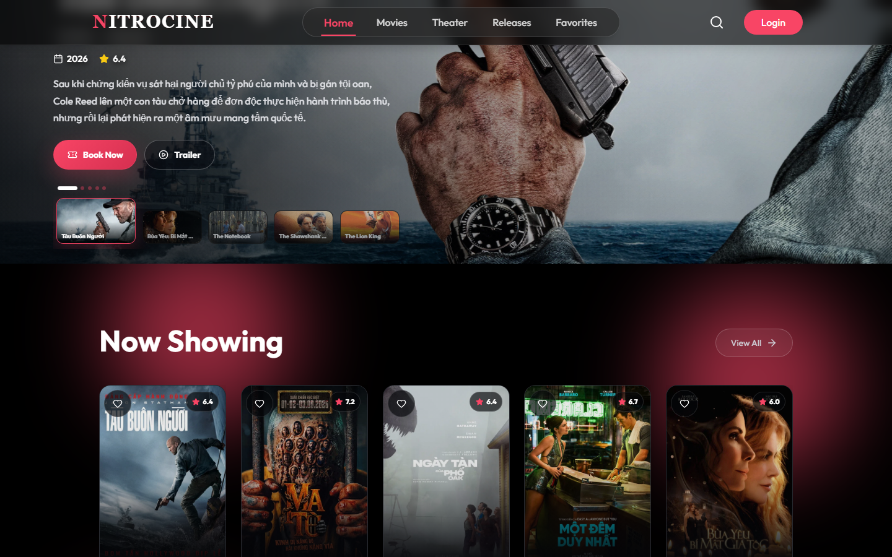 | 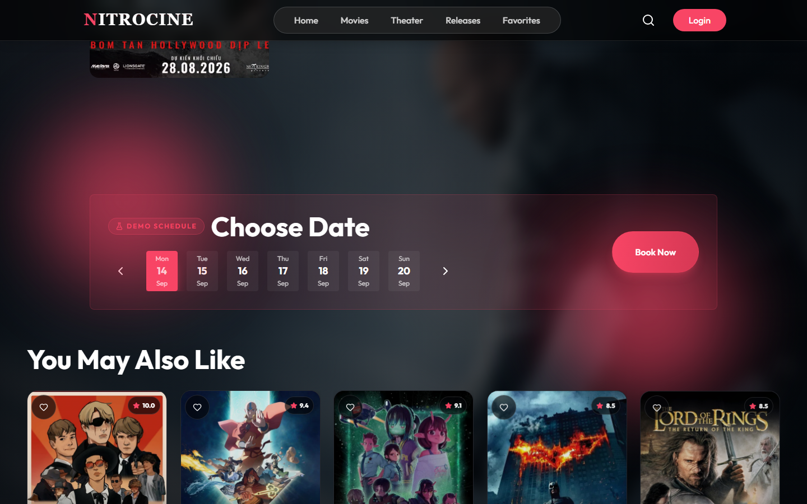 |
| **Trailer preview** | **Seat selection** |
|  | 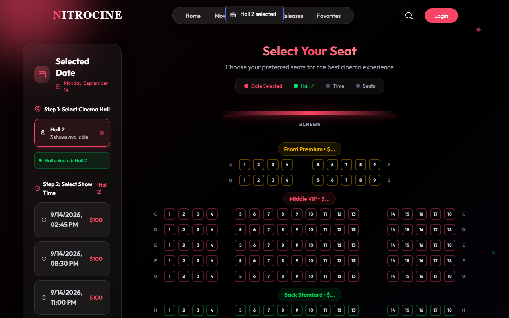 |
| **My bookings** | **Favorites** |
| 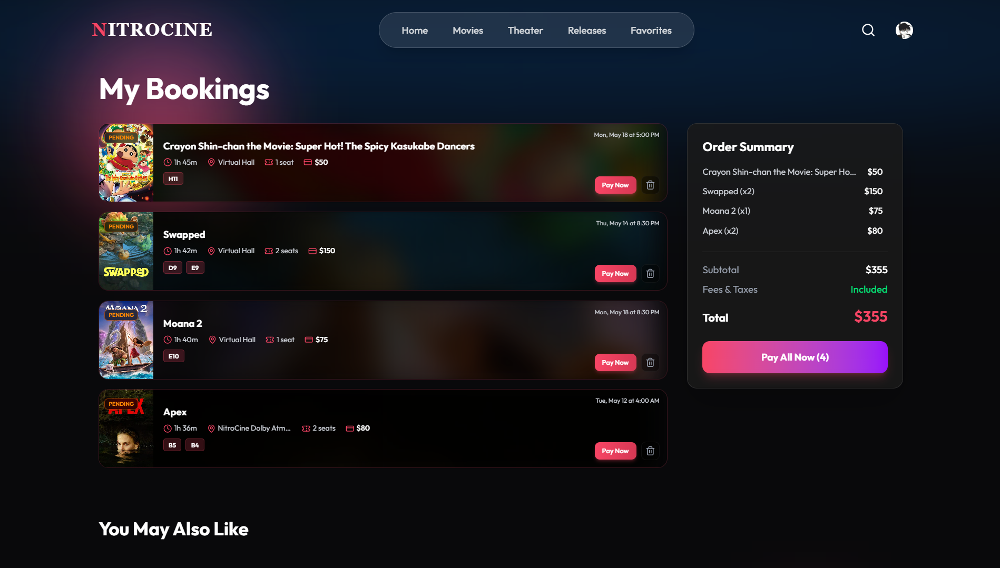 | 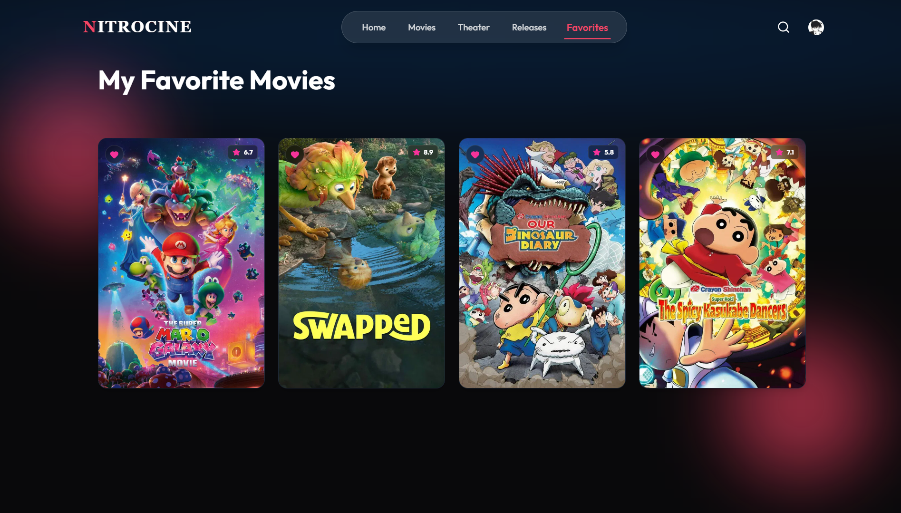 |
| **Search** | **Admin dashboard** |
| 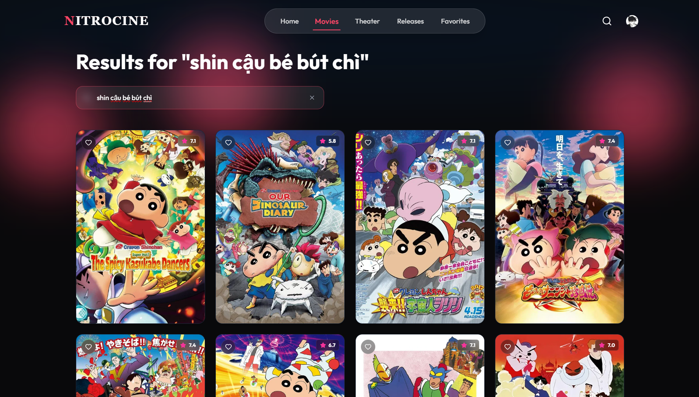 | 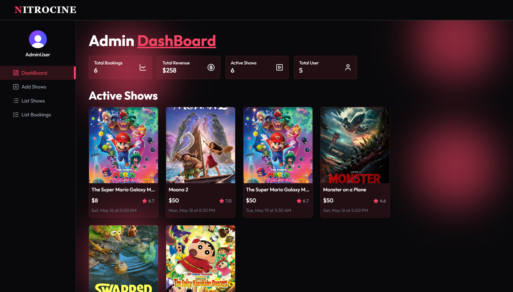 |
| **Mobile home** | **Admin: add shows** |
|  | 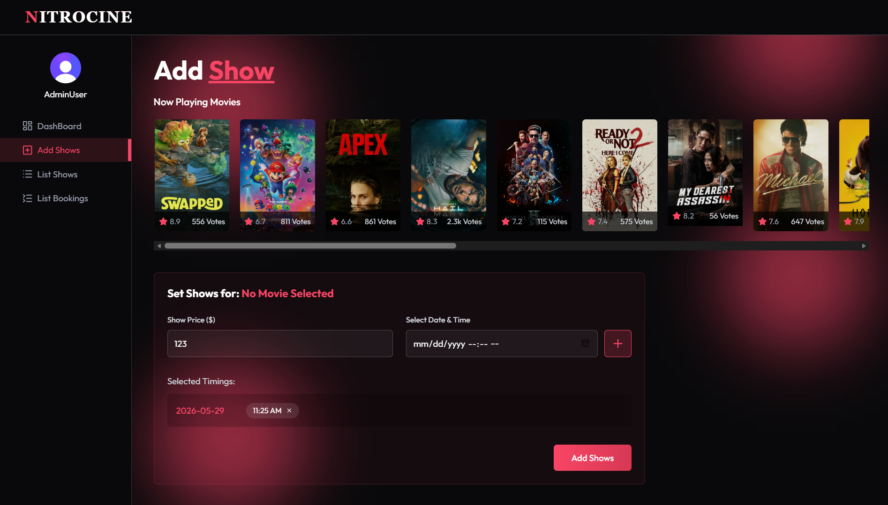 |

## Known limitations

- **Showtimes are simulated.** TMDB has no cinema schedules, and the app models a single cinema with four halls.
- **The demo uses Clerk development keys.** Switch to live Clerk and Stripe keys before real users sign up or pay.
- **Some components are still large.** `SeatLayout.jsx` and `showController.js` have grown big and are the next candidates for splitting.
- **End-to-end tests are not in CI yet.** They need a running backend with test credentials, so they run locally only.

## Author

**Nguyễn Đức Hoàng**: [GitHub @HoangDuc1003](https://github.com/HoangDuc1003)

Released under the [MIT License](./LICENSE).
