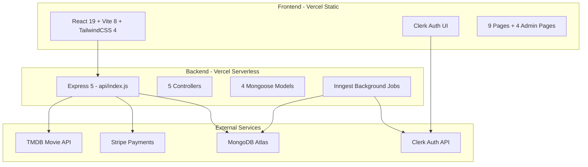
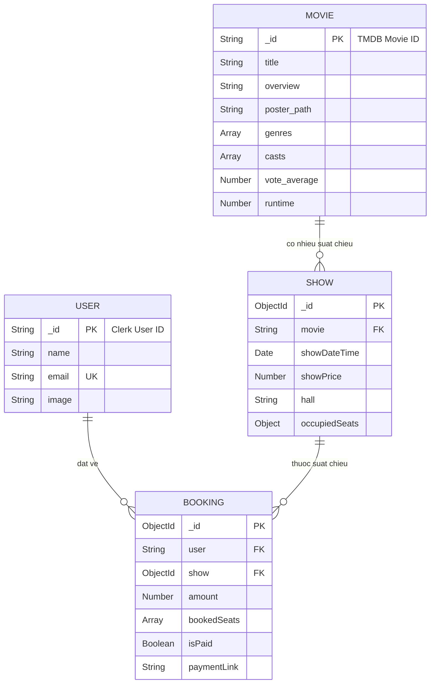
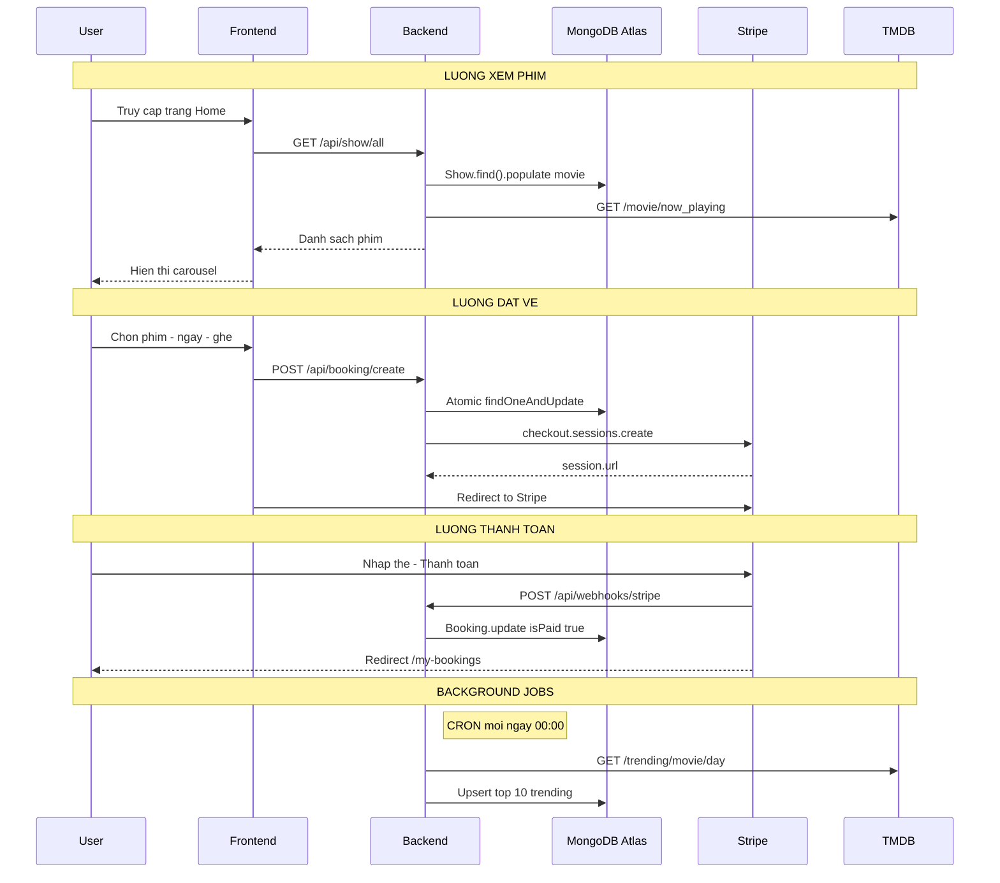
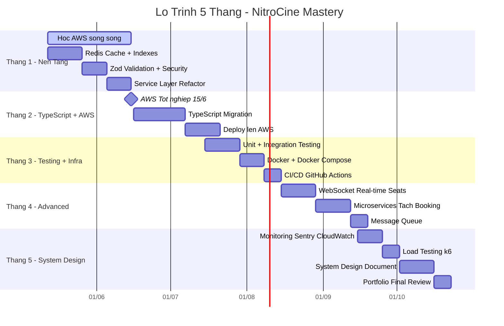
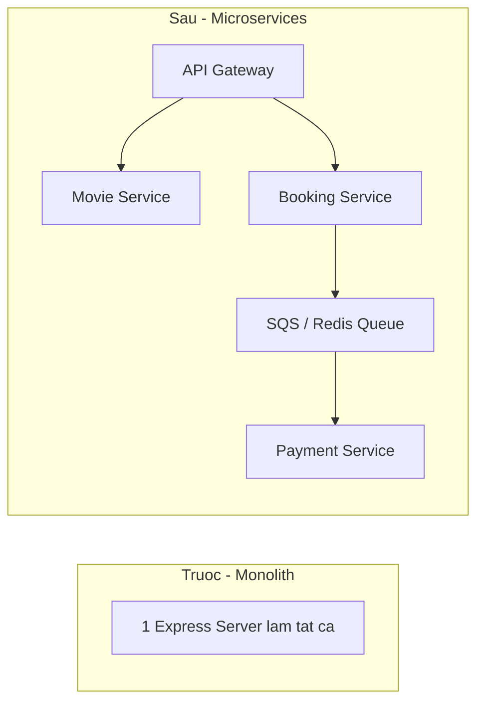

# NITROCINE — LO TRINH PHAT TRIEN & HOC TAP
> Bat dau: 12/05/2026 - Muc tieu: 10/2026 - Cap do dich: Top-Tier Junior (System Design Ready)

---

## Phan 1: KIEN TRUC HE THONG TONG QUAN



### Cau truc thu muc

```
NitroCine/
├── client/                         ← Frontend (React + Vite)
│   ├── src/
│   │   ├── App.jsx                 ← Routing chinh (lazy loading)
│   │   ├── components/             ← 12 reusable components
│   │   ├── pages/                  ← 9 pages + admin
│   │   │   └── SeatLayout.jsx      ← 40KB - phuc tap nhat
│   │   ├── context/                ← Global state
│   │   ├── hooks/                  ← Custom hooks
│   │   └── services/               ← API calls
│   └── vercel.json                 ← SPA rewrite rules
│
├── server/                         ← Backend (Express)
│   ├── api/index.js                ← Entry point (Vercel serverless)
│   ├── configs/db.js               ← MongoDB connection (IPv4 + DNS bypass)
│   ├── controllers/
│   │   ├── bookingController.js    ← 14.5KB - nghiep vu booking
│   │   ├── showController.js       ← 9KB - quan ly suat chieu
│   │   ├── stripeWebhooks.js       ← Xu ly thanh toan callback
│   │   ├── adminController.js      ← Dashboard admin
│   │   └── userController.js       ← Favorites, bookings
│   ├── models/                     ← 4 Mongoose schemas
│   ├── routes/                     ← 4 route files
│   ├── services/movieService.js    ← Import TMDB trending
│   └── inngest/index.js            ← Background jobs (CRON)
```

### Database Schema



---

## Phan 2: WORKFLOW HIEN TAI



| Luong | Mo ta | Diem yeu |
|---|---|---|
| **Xem phim** | DB + TMDB realtime | Cold start cham, rate limit |
| **Dat ve** | Atomic locking `$exists: false` | Virtual shows on-the-fly |
| **Thanh toan** | Stripe Checkout + Webhook | Can Stripe CLI cho localhost |
| **Background** | Inngest CRON daily | Khong retry khi TMDB down |

---

## Phan 3: LO TRINH NANG CAP HIEU SUAT

### Level 1: Lam ngay (Tuan 1-2)

#### 1. Redis Cache Layer

> Cai thien lon nhat. Moi request hien tai deu hit MongoDB truc tiep.

```javascript
import Redis from 'ioredis';
const redis = new Redis(process.env.REDIS_URL);

export const getShows = async (req, res) => {
    const cached = await redis.get('shows:all');
    if (cached) return res.json(JSON.parse(cached));
    const shows = await Show.find({}).populate('movie');
    await redis.setex('shows:all', 300, JSON.stringify(shows));
    res.json(shows);
};
```
**Dich vu mien phi:** Upstash Redis (https://upstash.com/)

#### 2. Database Indexes

```javascript
showSchema.index({ movie: 1, showDateTime: 1 });
bookingSchema.index({ user: 1, isPaid: 1 });
bookingSchema.index({ show: 1 });
```

#### 3. API Response Compression

```javascript
import compression from 'compression';
app.use(compression()); // Giam 60-80% response size
```

### Level 2: Kien truc (Thang 1-2)

#### 4. Rate Limiting + Security

```javascript
import rateLimit from 'express-rate-limit';
const apiLimiter = rateLimit({
    windowMs: 15 * 60 * 1000,
    max: 100,
    message: { success: false, message: 'Too many requests' }
});
app.use('/api/', apiLimiter);
```

#### 5. Input Validation (Zod)

```javascript
import { z } from 'zod';
const bookingInput = z.object({
    showId: z.string().min(1),
    selectedSeats: z.array(z.string()).min(1).max(10),
    totalAmount: z.number().positive().optional()
});
```

#### 6. Service Layer Pattern

```
Hien tai:  Controller → Model (tron logic + DB)
Nen la:    Controller → Service → Repository → Model
```

### Level 3: Production-Grade (Thang 3-5)

#### 7. TypeScript Migration

| Loi ich | Chi tiet |
|---|---|
| Bat loi som | IDE bao ngay khi access null property |
| Autocompletion | Goi y dung fields |
| Refactor an toan | Doi ten bao het cho can sua |

#### 8. Testing Pyramid

```
tests/
├── unit/           ← Vitest: logic thuan
├── integration/    ← Supertest: API + DB
└── e2e/            ← Playwright: browser
```

#### 9. CI/CD Pipeline

```yaml
name: NitroCine CI/CD
on: [push]
jobs:
  test:
    runs-on: ubuntu-latest
    steps:
      - uses: actions/checkout@v4
      - run: npm test
      - run: npm run lint
  deploy:
    needs: test
```

#### 10. Monitoring

| Cong cu | Muc dich | Free? |
|---|---|---|
| **Sentry** | Error tracking | Yes |
| **Vercel Analytics** | Performance | Yes |
| **MongoDB Atlas Monitor** | Slow queries | Yes |

---

## Phan 4: LO TRINH 5 THANG — TU JUNIOR DEN SYSTEM DESIGNER

> Moc quan trong: Hoan thanh khoa AWS vao **15/06/2026**. Toan bo lo trinh duoc thiet ke de kien thuc AWS tich hop lien mach ngay sau khi ban tot nghiep.



---

### THANG 1 (12/05 - 15/06): NEN TANG + HOAN THANH AWS

> Hoc AWS song song. Moi ngay: sang AWS, chieu code NitroCine.

#### Tuan 1-2: Performance Foundation

| Ngay | Viec lam | Output cu the |
|---|---|---|
| 1-2 | Doc Redis docs, setup Upstash | File `server/configs/redis.js` hoat dong |
| 3-4 | Implement Cache-Aside cho `getShows`, `getShow` | Response time giam tu ~2s xuong ~50ms |
| 5-6 | Cache invalidation khi `addShow`, `createBooking` | Data luon fresh sau mutation |
| 7-8 | Them MongoDB indexes cho 4 models | `explain()` cho thay IXSCAN thay vi COLLSCAN |
| 9-10 | `compression` middleware + do Lighthouse | Score Performance > 90 |
| 11-14 | Viet Redis wrapper class co logging | Production-ready cache module |

**Kien thuc dat duoc:**
- Cache-Aside pattern, Write-Through, Cache Invalidation
- MongoDB Index types (Single, Compound, Text)
- HTTP compression (gzip, brotli)

#### Tuan 3-4: Security + Architecture

| Ngay | Viec lam | Output cu the |
|---|---|---|
| 1-3 | Cai Zod, viet schema cho moi API input | File `server/validators/*.js` |
| 4-5 | Rate limiting + Helmet.js + CORS whitelist | Postman test DDoS bi chan |
| 6-7 | Tach `bookingController.js` thanh `bookingService.js` | Controller chi con ~20 dong/function |
| 8-10 | Tach `showController.js` thanh `showService.js` | Toan bo logic o Service layer |
| 11-14 | Error handling middleware global | File `middleware/errorHandler.js` |

**Kien thuc dat duoc:**
- Input validation, DTO pattern
- OWASP Top 10 basics
- Clean Architecture, SOLID principles
- Separation of Concerns

> **15/06: Tot nghiep AWS** — Tu day, ban da co kien thuc cloud de deploy NitroCine len AWS thay vi chi Vercel.

---

### THANG 2 (16/06 - 15/07): TYPESCRIPT + AWS DEPLOYMENT

> Thang nay la buoc nhay lon nhat. Ban vua xong AWS, ngay lap tuc ap dung vao du an thuc.

#### Tuan 1-3: TypeScript Migration

| Ngay | Viec lam | Output cu the |
|---|---|---|
| 1-2 | Setup TS: `tsconfig.json`, rename `.js` thanh `.ts` | Project compiles khong loi |
| 3-5 | Type moi Model: `IMovie`, `IShow`, `IBooking`, `IUser` | File `server/types/*.ts` |
| 6-8 | Type moi Controller: Request/Response generics | Het `any` trong controllers |
| 9-11 | Type Service layer + error types | Custom `AppError` class |
| 12-14 | Frontend: convert `context/`, `services/`, `hooks/` | Client-side TypeScript |
| 15-21 | Convert lan luot tung Page component sang `.tsx` | Toan bo project = TypeScript |

**Kien thuc dat duoc:**
- TypeScript generics, utility types, type guards
- Interface vs Type, discriminated unions
- Strict mode, `noImplicitAny`

#### Tuan 4: AWS Deployment (ap dung khoa AWS)

| Ngay | Viec lam | Dich vu AWS |
|---|---|---|
| 1-2 | Deploy backend len EC2 hoac ECS Fargate | EC2 / ECS |
| 3-4 | Setup MongoDB Atlas peering voi AWS VPC | VPC Peering |
| 5-6 | Frontend deploy len S3 + CloudFront CDN | S3, CloudFront |
| 7-8 | Route53 custom domain + SSL certificate | Route53, ACM |
| 9-10 | Environment variables trong Parameter Store | SSM |
| 11-14 | So sanh viet report: Vercel vs AWS (cost, speed, DX) | Tai lieu |

**Kien thuc dat duoc:**
- AWS EC2/ECS deployment thuc te
- VPC, Security Groups, IAM roles
- CDN distribution, DNS management
- Cost optimization (Vercel free tier vs AWS free tier)

---

### THANG 3 (16/07 - 15/08): TESTING + CONTAINERIZATION

> Tu thang nay, ban code theo TDD workflow: viet test truoc, code sau.

#### Tuan 1-2: Testing

| Viec lam | Cong cu | File output |
|---|---|---|
| Setup Vitest + config | Vitest | `vitest.config.ts` |
| Unit test BookingService (8 cases) | Vitest + mock | `tests/unit/bookingService.test.ts` |
| Unit test ShowService (5 cases) | Vitest + mock | `tests/unit/showService.test.ts` |
| Integration test Booking API | Supertest + MongoDB Memory Server | `tests/integration/booking.test.ts` |
| Integration test Stripe Webhook | Supertest + Stripe mock | `tests/integration/webhook.test.ts` |
| Coverage report > 70% | `vitest --coverage` | HTML coverage report |

**Test cases bat buoc cho BookingService:**
1. Dat ve thanh cong (happy path)
2. Ghe da bi chiem → tra 409 Conflict
3. Show khong ton tai → tra 404
4. Khong chon ghe → tra 400
5. Virtual show → tao show moi truoc khi booking
6. Stripe session tao thanh cong
7. Stripe fail → booking van ton tai (graceful degradation)
8. Transaction rollback khi DB error

#### Tuan 3-4: Docker + CI/CD

| Ngay | Viec lam | Output |
|---|---|---|
| 1-3 | Viet `Dockerfile` cho server + client | Multi-stage build, image < 200MB |
| 4-5 | `docker-compose.yml`: server + mongo + redis | `docker compose up` chay full stack |
| 6-7 | Push image len AWS ECR | ECR repository |
| 8-10 | GitHub Actions: test - build - deploy | `.github/workflows/ci.yml` |
| 11-14 | Branch protection: PR phai pass test moi merge | GitHub settings |

**Kien thuc dat duoc:**
- Test-Driven Development (TDD) mindset
- Docker multi-stage builds, layer caching
- CI/CD pipeline design
- Branch protection, code review workflow

---

### THANG 4 (16/08 - 15/09): ADVANCED FEATURES

> Thang nay ban them features ma chi senior moi nghi den.

#### Tuan 1-2: WebSocket Real-time

```
Van de hien tai:  User A dat ghe → User B khong biet → ca 2 dat cung ghe
Giai phap:        WebSocket broadcast khi ghe bi chiem real-time
```

| Ngay | Viec lam | Output |
|---|---|---|
| 1-2 | Setup Socket.io server | `server/configs/socket.ts` |
| 3-5 | Room-based: moi showId = 1 room | Users cung show thay realtime |
| 6-7 | Emit `seat:locked` khi booking thanh cong | SeatLayout.jsx update live |
| 8-10 | Heartbeat + reconnection logic | Khong mat ket noi khi tab inactive |
| 11-14 | Presence: hien thi "X nguoi dang xem" | UX nhu Tiki, Shopee flash sale |

#### Tuan 3-4: Tach Microservice + Message Queue



| Ngay | Viec lam | Output |
|---|---|---|
| 1-3 | Tach Booking thanh service rieng | `services/booking-service/` |
| 4-6 | API Gateway pattern (hoac simple proxy) | Route dispatch |
| 7-9 | Message queue: Booking → Queue → Payment | Async processing |
| 10-14 | Deploy 2 services doc lap tren AWS | ECS tasks rieng biet |

**Kien thuc dat duoc:**
- WebSocket, Socket.io rooms, connection management
- Microservices decomposition
- Message Queue patterns (pub/sub, work queue)
- AWS SQS hoac Redis Streams
- API Gateway pattern

---

### THANG 5 (16/09 - 15/10): SYSTEM DESIGN + PORTFOLIO

> Thang cuoi cung. Muc tieu: ban co the ngoi whiteboard ve kien truc va giai thich moi quyet dinh.

#### Tuan 1-2: Monitoring + Load Testing

| Viec lam | Cong cu | Output |
|---|---|---|
| Error tracking production | Sentry | Dashboard loi real-time |
| Performance monitoring | AWS CloudWatch | Alerts khi CPU > 80% |
| Structured logging | Winston/Pino | JSON logs, query-able |
| Load test 1000 concurrent users | k6 | Report: RPS, p95 latency, error rate |
| Identify bottlenecks tu load test | APM | Optimization plan |

#### Tuan 3-4: System Design Document + Portfolio

Viet **System Design Document** hoan chinh cho NitroCine:

```
nitrocine-system-design.md
├── 1. Requirements (Functional + Non-functional)
├── 2. Capacity Estimation (DAU, QPS, Storage)
├── 3. High-Level Architecture Diagram
├── 4. Database Design + Sharding Strategy
├── 5. API Design (RESTful conventions)
├── 6. Caching Strategy (Redis layers)
├── 7. Payment Flow (Stripe + idempotency)
├── 8. Real-time Architecture (WebSocket)
├── 9. Deployment Architecture (AWS)
├── 10. Monitoring + Alerting
├── 11. Security Considerations
└── 12. Trade-offs & Future Improvements
```

**Portfolio checklist:**

- [ ] GitHub README voi architecture diagram
- [ ] Live demo link (AWS deployment)
- [ ] System Design document (12 sections)
- [ ] Test coverage report > 70%
- [ ] CI/CD pipeline badge
- [ ] Performance report (k6 load test results)
- [ ] Blog post: "How I built a cinema booking system"

---

## Phan 5: DANH GIA TONG THE

### Diem manh hien tai
- Kien truc tach biet Frontend/Backend ro rang
- Lazy loading tat ca pages (code splitting)
- ErrorBoundary boc moi route (crash-safe)
- Atomic seat locking (tranh race condition)
- Stripe integration hoan chinh (single + batch)
- Inngest background jobs (auto trending)
- Defensive programming tren toan bo controllers

### Diem can cai thien
- **Khong co caching** → moi request deu hit DB
- **Khong co input validation** → `req.body` dung truc tiep
- **Khong co rate limiting** → de bi DDoS
- **Khong co tests** → khong biet code moi co pha code cu
- **SeatLayout.jsx 40KB** → nen tach nho
- **Serverless cold start** → 3-8s cho request dau

### Muc tieu sau 5 thang

| Tieu chi | Hien tai | Sau 5 thang |
|---|---|---|
| **Caching** | Khong co | Redis multi-layer |
| **Type Safety** | JavaScript thuan | TypeScript strict |
| **Testing** | 0% coverage | > 70% coverage |
| **Deployment** | Vercel only | AWS EC2/ECS + CI/CD |
| **Architecture** | Monolith | Microservices-ready |
| **Real-time** | Polling | WebSocket |
| **Monitoring** | console.log | Sentry + CloudWatch |
| **System Design** | Khong co | 12-section document |

> Sau 5 thang, ban se khong chi la "nguoi biet code" ma la **nguoi hieu he thong**. Ban co the dung truoc whiteboard ve kien truc cho bat ky ung dung booking nao, giai thich trade-offs giua SQL vs NoSQL, monolith vs microservices, va tai sao ban chon tung cong nghe. Do la khoang cach giua junior binh thuong va top-tier junior.

---

## Phan 6: TAI LIEU HOC TAP THEO TUNG THANG

| Thang | Chu de chinh | Tai lieu |
|---|---|---|
| 1 | Redis, Security, Clean Architecture | Redis University RU101, OWASP Top 10, Clean Architecture (Robert C. Martin) |
| 2 | TypeScript, AWS Deployment | TypeScript Handbook, AWS Well-Architected Framework |
| 3 | Testing, Docker, CI/CD | Vitest docs, Docker docs, GitHub Actions docs |
| 4 | WebSocket, Microservices, Message Queue | Socket.io docs, Building Microservices (Sam Newman) |
| 5 | System Design, Monitoring | Designing Data-Intensive Applications (Martin Kleppmann), k6 docs |

> Cuon sach quan trong nhat trong toan bo lo trinh: **"Designing Data-Intensive Applications"** cua Martin Kleppmann. Doc xong cuon nay, ban se hieu tai sao moi quyet dinh kien truc trong NitroCine duoc dua ra. Nen bat dau doc tu thang 3 tro di khi da co du context thuc te.
